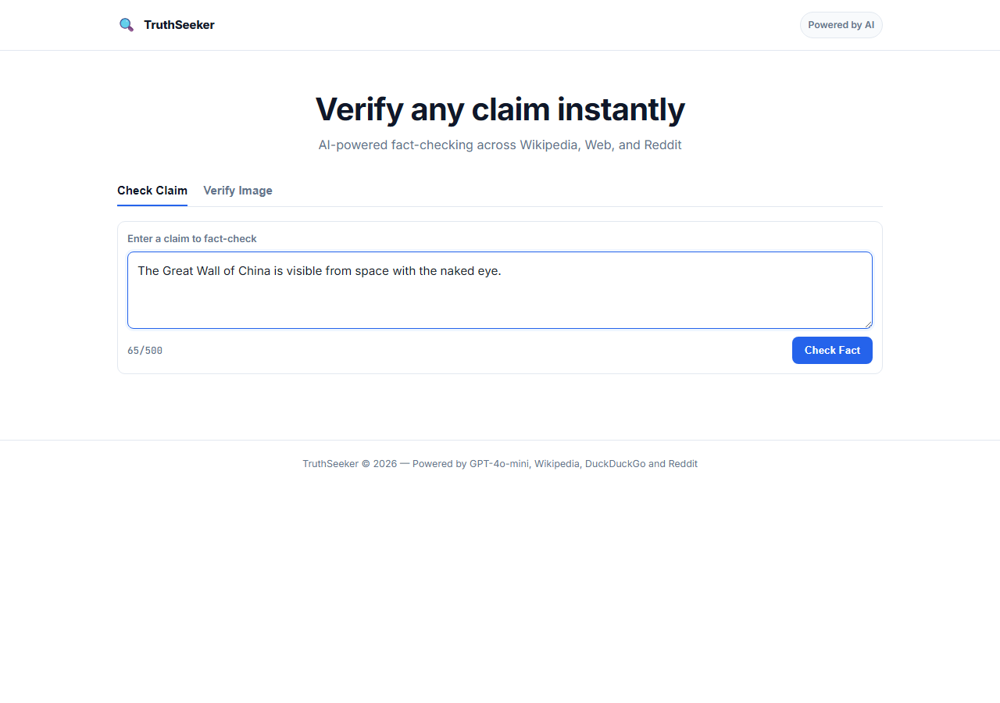
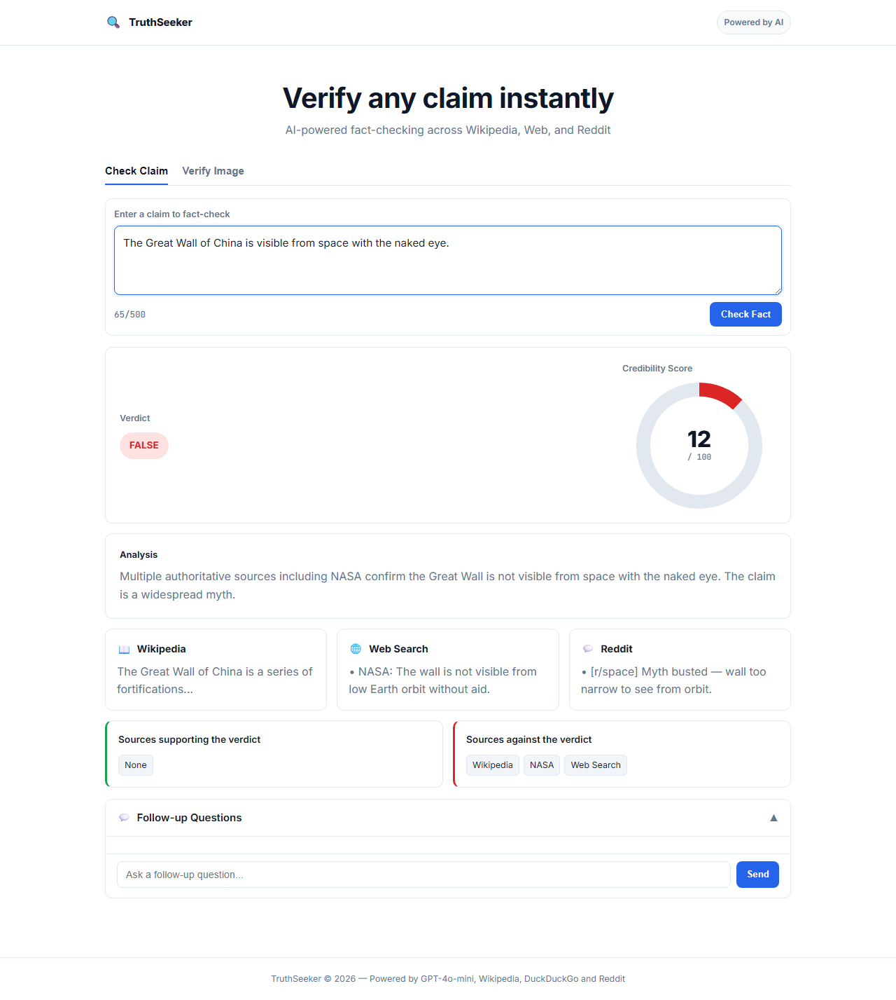
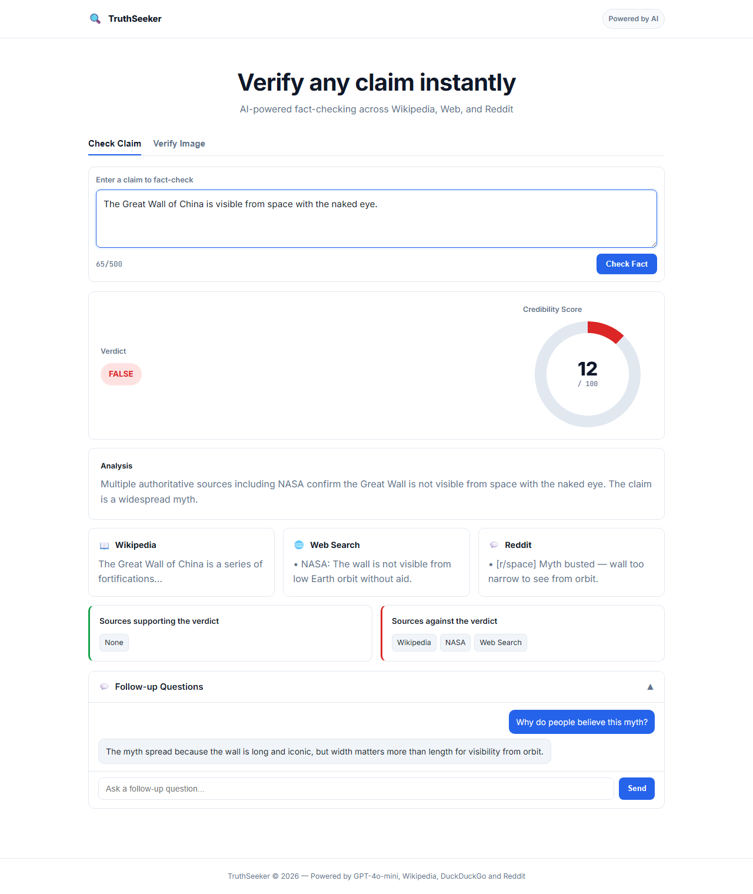

# TruthSeeker

> AI-Powered Fact Checking — search Wikipedia, DuckDuckGo and Reddit simultaneously, then synthesise a verdict with GPT-4o-mini.

## Screenshots

| Home | Fact-check results | Follow-up chat |
|------|-------------------|----------------|
|  |  |  |

---

## Architecture

```
truthseeker/
├── backend/
│   ├── main.py              # FastAPI app + CORS + 3 endpoints
│   ├── models.py            # Pydantic request / response schemas
│   ├── memory.py            # Rolling per-session dialogue memory
│   └── agents/
│       ├── fact_checker.py  # Orchestrator — asyncio.gather() pipeline
│       ├── wikipedia.py     # Wikipedia REST v1 summary API
│       ├── web_search.py    # DuckDuckGo search (duckduckgo-search)
│       └── reddit.py        # Reddit public JSON API
├── frontend/
│   ├── index.html           # Single-page UI (no build step)
│   ├── style.css            # Dark-theme styles
│   └── app.js               # Fetch calls + Chart.js doughnut
├── requirements.txt
├── render.yaml              # One-click Render deployment
└── .env.example
```

### How it works

1. The user types a claim and clicks **Check Fact**.
2. The frontend POSTs `{ claim, session_id }` to `/fact-check`.
3. The backend fires three searches **in parallel** (`asyncio.gather`):
   - **Wikipedia** – REST summary endpoint, first 500 chars
   - **DuckDuckGo** – top 3 result snippets via `duckduckgo-search`
   - **Reddit** – top 3 posts from the public JSON search API
4. All evidence is combined into a context string and sent to **GPT-4o-mini**.
5. The model returns a structured JSON verdict (`TRUE` / `FALSE` / `MISLEADING` / `UNVERIFIED`) with a credibility score (0–100) and reasoning.
6. The result is displayed in the UI with a **Chart.js doughnut chart** and source cards.
7. The user can ask follow-up questions in the **chat panel** — session memory keeps the last 10 messages for context.

---

## Prerequisites

| Tool | Version |
|------|---------|
| Python | ≥ 3.10 |
| pip | latest |

---

## Run locally

```bash
# 1 – Clone / enter the project
cd truthseeker

# 2 – Create and activate a virtual environment
python -m venv .venv
source .venv/bin/activate      # Windows: .venv\Scripts\activate

# 3 – Install dependencies
pip install -r requirements.txt

# 4 – Set your OpenAI API key
cp .env.example .env
# Edit .env and replace the placeholder with your real key

# 5 – Start the API server (from the truthseeker/ root)
uvicorn backend.main:app --reload --host 0.0.0.0 --port 8000

# 6 – Open the frontend
# Simply open  frontend/index.html  in your browser — no build step needed.
# The file already points to http://localhost:8000
```

---

## API endpoints

| Method | Path | Description |
|--------|------|-------------|
| `GET`  | `/health` | Liveness probe — returns `{"status":"ok"}` |
| `POST` | `/fact-check` | Run the full fact-checking pipeline |
| `POST` | `/chat` | Conversational follow-up using session memory |

### POST `/fact-check`

**Request body**
```json
{
  "claim": "The Great Wall of China is visible from space.",
  "session_id": "uuid-v4-generated-by-client"
}
```

**Response**
```json
{
  "verdict": "FALSE",
  "credibility_score": 12,
  "reasoning": "Multiple authoritative sources confirm ...",
  "supporting_sources": [],
  "contradicting_sources": ["Wikipedia", "Web Search"],
  "wikipedia_snippet": "The Great Wall of China...",
  "web_snippets": "• NASA confirms...",
  "reddit_snippets": "• [r/space] Myth busted..."
}
```

---

## Deploy to Render

1. Push this repo to GitHub.
2. Go to [render.com](https://render.com) → **New Web Service** → connect your repo.
3. Render reads `render.yaml` automatically and configures the service.
4. Add the `OPENAI_API_KEY` environment variable in the Render dashboard.
5. Once deployed, update `API_BASE` in `frontend/app.js` to your Render URL.

---

## Environment variables

| Variable | Required | Description |
|----------|----------|-------------|
| `OPENAI_API_KEY` | Yes | Your OpenAI API key |

---

## License

MIT
